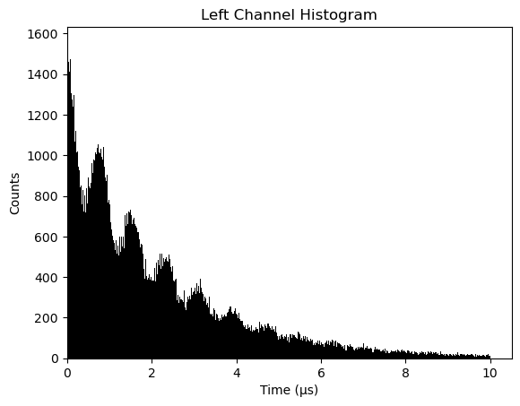
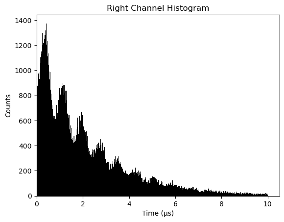
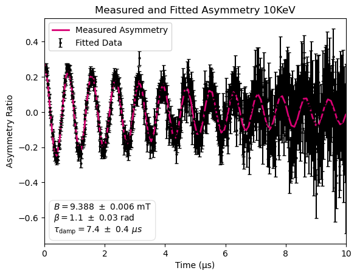
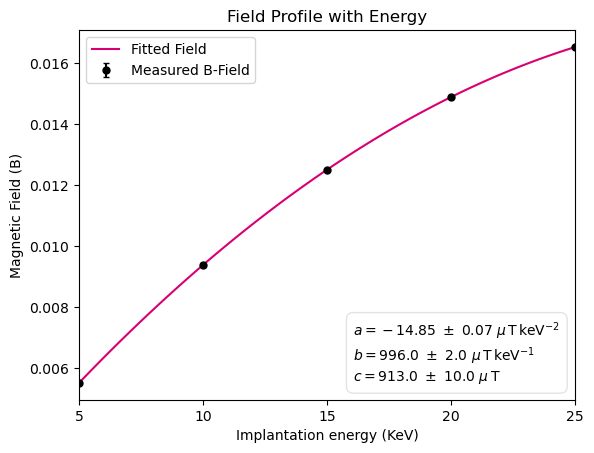

# Muon Detector Signal Processing Pipeline

Python analysis pipeline for muon detector time/channel data. The code:

* loads a dataset from `data/`
* builds left/right histograms
* computes asymmetry (A(t)) with uncertainties
* fits a damped oscillation model to extract (B), (\beta), and (\tau) (with uncertainties)
* for multi-energy datasets, computes (B(E)) and fits a quadratic field profile

## Repo layout

* `code/` — all Python source files
* `data/` — example datasets (included so the repo runs immediately)
* `figures/` — saved example plots shown below (optional, but recommended)

## Requirements

Install dependencies:

```bash
pip install -r requirements.txt
```

## Run

From the project root (the folder that contains `code/` and `data/`):

```bash
python code/run.py
```

Running the script prints a results dictionary and displays plots via `matplotlib` (`plt.show()`).

## Choosing which example dataset to run

This repo contains three example datasets in `data/`:

* `data_1`
* `data_2`
* `data_3`

By default, `code/run.py` points to one of them. To test a different dataset:

1. Open `code/run.py`
2. Change the `DATA = ...` line, for example:

```python
DATA = ROOT / "data" / "data_1"   # switch to data_2 or data_3
```

3. Run again:

```bash
python code/run.py
```

## Output

The pipeline returns/prints a dictionary containing (at minimum):

* `10keV_B`, `10keV_B_error`
* `beta`, `beta_error`
* `10keV_tau_damp`, `10keV_tau_damp_error`
* `B(Energy)_coeffs`, `B(Energy)_coeffs_errors`

## Example plots (click to expand)

> Save your four example plots into `figures/` and update the filenames below to match.

<details>
  <summary>Show example outputs (4 plots)</summary>

### Left histograms



### Right histograms



### 10 keV asymmetry fit



### Field profile vs energy (quadratic fit)




</details>

## Notes

These files are included for demonstration and testing, not real data purely educational 

